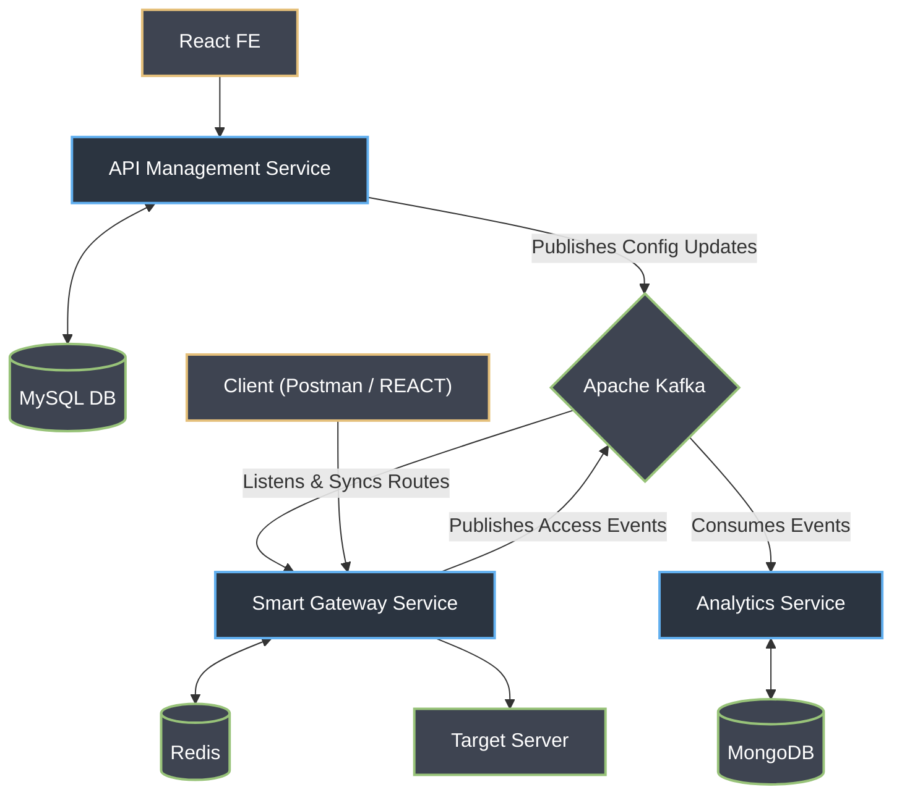

# 🌌 Orbit Smart API Gateway


An enterprise-grade, custom API Gateway engineered for high performance and distributed backend environments. Orbit acts as a secure reverse proxy for microservices, guaranteeing optimal system scalability by maintaining a strict, clear separation between the synchronous request-processing path and asynchronous background telemetry tasks.

## 📐 System Architecture & Working

The architecture utilizes a highly decoupled, event-driven microservices ecosystem designed for high availability and zero-latency operations.

1. **The Control Plane (Event-Driven Sync):** Administrators use the React UI to define routing rules and access policies. The **API Management Service** stores these in **MySQL** and publishes configuration update events to **Apache Kafka**. 
2. **The Data Plane (Client Flow):** Incoming requests are intercepted by **Spring Security** (OAuth2). The **Smart Gateway Service** continuously listens to Kafka to dynamically sync routes. It checks **Redis** for rate-limiting and proxies authorized requests to the **Target Server**.
3. **The Telemetry Pipeline (Background Flow):** To ensure zero-latency for the client, the Gateway asynchronously publishes access events back to **Apache Kafka**. The decoupled **Analytics Service** consumes these events and persists them into **MongoDB**.


## Core Features
```mermaid
graph LR
    Root["🚀 Orbit API Gateway"]
    
    Root --> Sec["🔒 Security"]
    Sec --> S1("Spring Security")
    Sec --> S2("OAuth2 Authorization")
    Sec --> S3("AOP Auditing via AspectJ")

    Root --> Traf["🚦 Traffic Control"]
    Traf --> T1("Redis Rate Limiting")
    Traf --> T2("Route-Level Timeouts")

    Root --> Rout["🔀 Routing & Proxy"]
    Rout --> R1("Dynamic Reverse Proxy")
    Rout --> R2("Header & Path Transformation")

    Root --> Res["🛡️ Resilience"]
    Res --> Re1("Idempotent POST")
    Res --> Re2("Global Exception Handling")

    Root --> Obs["👁️ Telemetry & Storage"]
    Obs --> O1("Kafka Event Publishing")
    Obs --> O2("MongoDB Analytics")
    Obs --> O3("MySQL Configurations")
